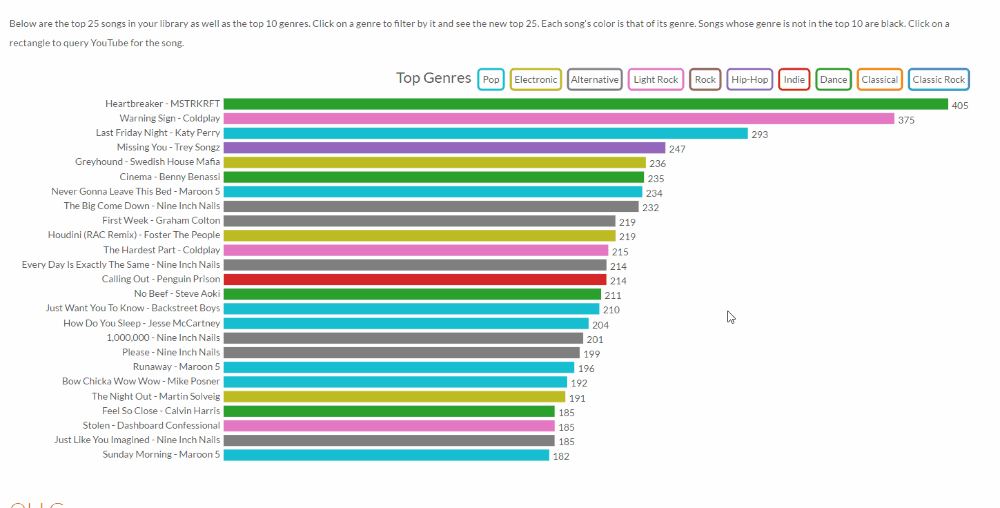

# [iTunesAnalysis](http://theconnman.com/iTunesAnalysis)
The iTunes Analyzer is a small project to provide analytics about your iTunes library. The demo data is of my library but by uploading your **iTunes Music Library.xml** file you can analyze your own library out of the box.

The iTunes Analyzer is also an experimental project of mine to learn more about [D3.js](http://d3js.org/) which is heavily used throughout the project. Below is a list of the analytics available.

## Top Songs
The most basic metric of a library is its top songs. The top songs are listed showing song name, artist, play count, and genre. The top genres are also shown as filters, allowing you to find the top songs within a genre or set of genres. Transitions and layouts are created by utilizing [D3.js](http://d3js.org/).

## Old Gems
Old Gems shows a calendar heatmap of how many songs were last played on any given day. Clicking on a day will list the top songs that were last played on that day. It's a good way to find some of those old gems you haven't heard in a while as well as get an overview of your listening habits.

## Skipped Songs
Skipped Songs is the same as Top Songs except for the songs you've skipped the most. I can't say I'm surprised by some of the top skipped songs in my library. The subtlety of Skipped Songs is that to skip songs they had to come up often, usually meaning they're on a popular playlist or two.

## Play Count Distribution
Play Count Distribution uses the distribution type graph and shows a stacked histograph of how many songs have been played how many times. The unfiltered view is fairly uninteresting (there are a lot of songs I have only listened to 0-5 times), but filtering brings out some unexpected results.

## Song Length Distribution
Song Length Distribution uses the distribution graph again and shows the distribution of song lengths. The unfiltered view looks vaguely [Poisson](http://en.wikipedia.org/wiki/Poisson_distribution) and the filtered views shed some light on the average song length of different genres.

## Top Artists
Top Artists shows the top songs again but highlights the top artists instead of genres.

## Date Added
Date Added uses the heatmap calendar visualization again to show how many songs were added on any given day. It helps show your iTunes library growth trends.
